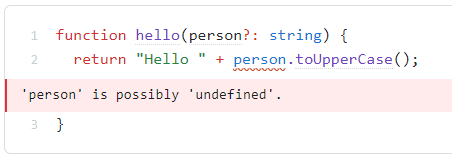

# アロー関数
## アロー関数の型注釈
TSでは引数、戻り値に型注釈が書ける  
参考：https://typescriptbook.jp/reference/functions/arrow-functions
```typescript
const increment = (num: number): number => num + 1;
//                              ^^^^^^^^戻り値の型注釈 
```

# オプション引数
TS固有の機能  
参考: https://typescriptbook.jp/reference/functions/optional-parameters#%E3%82%AA%E3%83%97%E3%82%B7%E3%83%A7%E3%83%B3%E5%BC%95%E6%95%B0%E3%81%AE%E6%A7%8B%E6%96%87
## オプション引数の構文
```typescript
function hello(person?: string) {}
hello(); // 省略もできる、つまりオプション
hello("alice");
```

## 引数を省略するとundefinedになる
オプション引数の型は、指定した型またはundefinedのユニオン型になる
```typescript
function hello(person?: string) {}
//             ^^^^^^^(parameter) person: string | undefined
```
つまり、undefined型に存在しないメソッドはエラーになる
```typescript
function hello(person?: string) {
  return "Hello " + person.toUpperCase();
}
```
  
この問題を解消するには3つの方法がある
1. 引数がundefinedの場合分けをif文で書き、そこでデフォルト値を代入する方法
```typescript
function hello(person?: string) {
  if (typeof person === "undefined") {
    person = "anonymous";
  }
  return "Hello" + person.toUpperCase();
}
```
2. Null合体代入演算子??=でデフォルト値を代入する方法
```typescript
function hello(person?: string) {
  person ??= "anonymous"; // 
  return "Hello" + person.toUpperCase();
}
```
3. デフォルト引数を指定する【推奨】
```typescript
function hello(person: string = "anonymous") {
  //                        ^^^^^^^^^^^^^^デフォルト引数
  return "Hello" + person.toUpperCase();
}
```